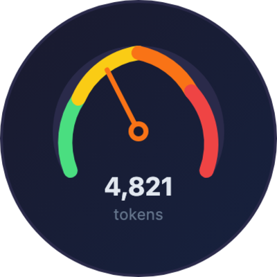

<p align="center">
  
</p>

<h1 align="center">ai-context-kit</h1>

<p align="center">
  <strong>How do you measure your context?</strong>
</p>

<p align="center">
  You spent hours writing the perfect .md context file, just to find out that your agent got <em>worse</em>.<br>
  That's not a bug. That's what happens when nobody measures the cost of context.
</p>

<p align="center">
  <a href="#quick-start"></a>
  &nbsp;
  <a href="#api"></a>
  &nbsp;
  <a href="#cli"></a>
  &nbsp;
  <a href="#use-with-vercel-ai-sdk--langchain--custom-agents"></a>
</p>

<p align="center">
  <a href="https://github.com/ofershap/ai-context-kit/stargazers"></a>
  &nbsp;
  <a href="https://www.npmjs.com/package/ai-context-kit"></a>
  <a href="https://www.npmjs.com/package/ai-context-kit"></a>
  <a href="https://github.com/ofershap/ai-context-kit/actions/workflows/ci.yml"></a>
  <a href="https://www.typescriptlang.org/"></a>
  <a href="https://opensource.org/licenses/MIT"></a>
  <a href="https://img.shields.io/badge/dependencies-0-brightgreen"></a>
  <a href="https://makeapullrequest.com"></a>
</p>

---

You write a CLAUDE.md. Then someone adds `.cursor/rules/`. Then a teammate drops in an AGENTS.md. Then someone copies in a `.cursorrules` file from a blog post. Nobody removes the old ones.

Six months later your project has four context files that overlap, contradict each other, and dump 8,000 tokens of directory listings and "follow best practices" into every conversation. Your agent follows all of it. It gets slower. It gets confused. You blame the model.

An [ETH Zurich study](https://www.sri.inf.ethz.ch/publications/gloaguen2026agentsmd) (February 2026) measured what actually happens when you give agents context files:

- Auto-generated context files **reduced** task success compared to providing nothing
- Human-written ones only improved accuracy by **4%**
- Inference costs jumped **20%+** from wasted tokens
- Performance dropped on some models because agents got **too obedient** - following unnecessary instructions instead of solving the actual problem

I kept hitting this in my own projects, so I built `ai-context-kit` - a toolkit to treat context like a budget. Measure it, trim it, inject only what the current task needs.

```typescript
import { loadRules, measure, lint, select } from "ai-context-kit";

const rules = await loadRules("./");

measure(rules, 4000); // what does your context cost?
lint(rules); // conflicts? duplicates? dead weight?
select(rules, {
  task: "fix auth bug", // only inject what matters
  budget: 2000, // stay within token budget
});
```

---

## Quick Start

```bash
npm install ai-context-kit
```

Run the CLI on any project to see what you're actually injecting:

```bash
npx ai-context-kit measure
```

```
ai-context-kit measure - 6 rule file(s)

  Total: 4,821 tokens

  ############ 2,100 tokens (44%) - .cursor/rules/conventions.mdc
  ######## 1,200 tokens (25%) - CLAUDE.md
  ##### 890 tokens (18%) - .cursor/rules/api-patterns.mdc
  ## 340 tokens (7%) - AGENTS.md
  ## 180 tokens (4%) - .cursor/rules/testing.mdc
  # 111 tokens (2%) - .github/copilot-instructions.md
```

Then lint it:

```bash
npx ai-context-kit lint
```

```
ai-context-kit lint - 6 rule file(s)

  [!] .cursor/rules/conventions.mdc
      Rule is 2100 tokens. Consider splitting to keep each file under 2000 tokens.

  [x] CLAUDE.md
      Conflicts with AGENTS.md: "always use semicolons" vs "never use semicolons"

  [!] CLAUDE.md
      Duplicated line also found in .cursor/rules/conventions.mdc. Duplicates waste tokens.

  [i] AGENTS.md
      Contains vague instruction matching "follow best practices".
      Specific instructions produce better results than general advice.

  Score: 70/100 (FAILED)
```

That's the difference between guessing and knowing.

---

## What's Different

|                | Other approaches                                 | ai-context-kit                                               |
| -------------- | ------------------------------------------------ | ------------------------------------------------------------ |
| Context cost   | Nobody measures it                               | Token count per file with budget check                       |
| Conflicts      | You find out when the agent does something weird | Detects contradictions across all files automatically        |
| Duplicates     | Same rule in 3 files, 3x the tokens              | Flagged and scored                                           |
| Task relevance | Every rule injected every time                   | `select()` picks only what matters for the current task      |
| Multi-tool     | Locked to one IDE's format                       | Works across Cursor, Claude Code, Copilot, Windsurf, Cline   |
| CI             | Hope for the best                                | `lint` exits with code 1 on errors. Drop it in your pipeline |

---

## What This Answers

1. **How much context am I injecting?** Token count per file, percentage breakdown, budget check
2. **Are my rules fighting each other?** Conflict detection across all files and formats
3. **What's wasting tokens?** Directory listings, duplicate content, vague advice
4. **Which rules matter for this task?** Task-relevant selection with token budget

---

## How It Works

ai-context-kit reads every context file format in the ecosystem, parses frontmatter, estimates token cost, and gives you tools to analyze and manage them.

|               |                                                                                                                                     |
| ------------- | ----------------------------------------------------------------------------------------------------------------------------------- |
| `loadRules()` | Auto-detects `.cursor/rules/`, `.cursorrules`, `CLAUDE.md`, `AGENTS.md`, `copilot-instructions.md`, `.windsurfrules`, `.clinerules` |
| `measure()`   | Token cost per rule, percentage of total, budget check                                                                              |
| `lint()`      | Conflicts, duplicates, bloat, vague instructions, useless directory trees. Scores 0-100                                             |
| `select()`    | Picks rules relevant to the current task. Respects a token budget. `alwaysApply` rules first, then by relevance                     |
| `sync()`      | Single source of truth. Write once in `.cursor/rules/`, sync to CLAUDE.md, AGENTS.md, and the rest                                  |
| `init()`      | Starter template with tips from the research                                                                                        |

---

## API

### `loadRules(rootDir?)`

```typescript
const rules = await loadRules("./");
// Finds every context file in the project

const rules = await loadRules(".cursor/rules/");
// Or load from a specific directory
```

Returns `RuleFile[]` with parsed frontmatter, body, format, path, and token count.

### `measure(rules, budget?)`

```typescript
const report = measure(rules, 4000);

report.totalTokens; // 3847
report.overBudget; // false
report.rules; // sorted by size, each with tokens + percentage
```

### `lint(rules)`

```typescript
const report = lint(rules);

report.score; // 85/100
report.passed; // true (no errors, warnings don't fail)
report.issues; // array of { rule, path, severity, message }
```

What the linter catches:

| Rule                | Severity      | What it finds                                                |
| ------------------- | ------------- | ------------------------------------------------------------ |
| `token-budget`      | warning/error | Files over 2,000 tokens (warning) or 5,000 (error)           |
| `empty-rule`        | warning       | Files too short to do anything                               |
| `duplicate-content` | warning       | Same instruction repeated across files                       |
| `conflict`          | error         | "always use X" in one file, "never use X" in another         |
| `directory-listing` | warning       | 10+ line directory trees that agents don't need              |
| `vague-instruction` | info          | "follow best practices", "write clean code", "be consistent" |

### `select(rules, options)`

The core insight from the research: don't inject everything. Pick what matters.

```typescript
const relevant = select(rules, {
  task: "fix auth bug in /api/auth",
  budget: 2000,
  tags: ["security", "api"],
  exclude: ["style"],
});
```

Scoring: `alwaysApply: true` in frontmatter gets highest priority. Then task words matched against file paths and content. Then tag matches. Budget is respected - highest-scored rules are included first until the budget runs out.

### `sync(options)`

Write rules once, sync everywhere.

```typescript
await sync({
  source: ".cursor/rules/",
  targets: ["CLAUDE.md", "AGENTS.md", ".github/copilot-instructions.md"],
});
```

Supports `dryRun: true` to preview changes without writing.

### `init(options?)`

```typescript
await init({ format: "cursor-rules" });
// Creates .cursor/rules/conventions.mdc with research-backed starter template
```

---

## CLI

```bash
npx ai-context-kit lint                    # find issues
npx ai-context-kit lint --json             # machine-readable output
npx ai-context-kit measure                 # token cost breakdown
npx ai-context-kit measure --budget 4000   # check against budget
npx ai-context-kit sync --source .cursor/rules/ --target CLAUDE.md,AGENTS.md
npx ai-context-kit init                    # scaffold starter rules
npx ai-context-kit init --format claude-md
```

All commands support `--path <dir>` to point at a different project root. `lint` exits with code 1 on errors (warnings pass).

---

## Use with Vercel AI SDK / LangChain / Custom Agents

This isn't just for Cursor. If you're building agents with Vercel AI SDK, LangChain, or your own framework, ai-context-kit solves the same problem: how much context are you stuffing into the system prompt, and is it helping or hurting?

```typescript
import { loadRules, select } from "ai-context-kit";
import { generateText } from "ai";

const allRules = await loadRules("./rules");

const relevant = select(allRules, {
  task: userMessage,
  budget: 3000,
});

const systemPrompt = relevant.map((r) => r.body).join("\n\n");

const { text } = await generateText({
  model: openai("gpt-4o"),
  system: systemPrompt,
  prompt: userMessage,
});
```

Any framework that takes a system prompt string. Any rules stored as markdown files.

---

## Supported Formats

| Format          | File                              | Used by              |
| --------------- | --------------------------------- | -------------------- |
| Cursor (modern) | `.cursor/rules/*.mdc`             | Cursor IDE           |
| Cursor (legacy) | `.cursorrules`                    | Cursor IDE           |
| Claude Code     | `CLAUDE.md`                       | Claude Code          |
| AGENTS.md       | `AGENTS.md`                       | Cross-agent standard |
| GitHub Copilot  | `.github/copilot-instructions.md` | GitHub Copilot       |
| Windsurf        | `.windsurfrules`                  | Windsurf             |
| Cline           | `.clinerules`                     | Cline                |

ai-context-kit detects the format from the file path. No configuration needed.

---

## Roadmap

- [ ] Semantic duplicate detection (not just exact matches)
- [ ] `watch` mode - re-lint on file changes
- [ ] Config file support (`.contextkitrc`)
- [ ] MCP server - expose lint/measure as tools your agent can call on itself
- [ ] VS Code / Cursor extension with inline token counts
- [ ] Rule effectiveness scoring based on agent outcomes
- [ ] Community rule templates (share what works)

Have an idea? [Open a discussion](https://github.com/ofershap/ai-context-kit/discussions).

---

<details>
<summary><strong>Why not just write better rules?</strong></summary>

The ETH Zurich study tested both human-written and LLM-generated context files. Human-written ones were better, but only by 4%. The real problem isn't quality - it's volume. More context means more tokens consumed by instructions the agent doesn't need for the current task. The winning strategy is fewer, task-relevant rules, not better prose.

</details>

<details>
<summary><strong>How accurate is the token estimation?</strong></summary>

ai-context-kit uses a 4-character-per-token approximation. This is intentionally simple and fast. It's accurate enough for budgeting and comparison (GPT-4 averages ~4 chars/token for English text). If you need exact counts, pipe the output through tiktoken or your model's tokenizer.

</details>

<details>
<summary><strong>Does this work in CI?</strong></summary>

Yes. `npx ai-context-kit lint` returns exit code 1 on errors, 0 on pass. Add it to your CI pipeline the same way you'd add eslint. The `--json` flag gives machine-readable output for custom reporting.

</details>

---

**Stack:** TypeScript (strict) · Vitest · tsup (ESM + CJS) · zero runtime dependencies

---

## Contributing

PRs welcome. Whether it's a new lint rule, a format detector, or a bug fix - check out the [contributing guide](CONTRIBUTING.md).

---

## Author

[](https://gitshow.dev/ofershap)

[](https://linkedin.com/in/ofershap)
[](https://github.com/ofershap)

## License

[MIT](LICENSE) &copy; [Ofer Shapira](https://github.com/ofershap)

---

<p align="center">
  <a href="https://github.com/ofershap/ai-context-kit">Star this repo</a> · <a href="https://github.com/ofershap/ai-context-kit/fork">Fork it</a> · <a href="https://github.com/ofershap/ai-context-kit/issues">Report a bug</a> · <a href="https://github.com/ofershap/ai-context-kit/discussions">Join the discussion</a>
</p>
